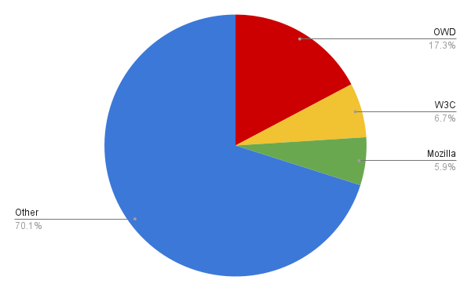
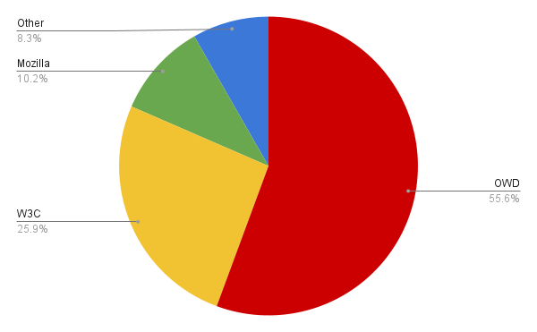
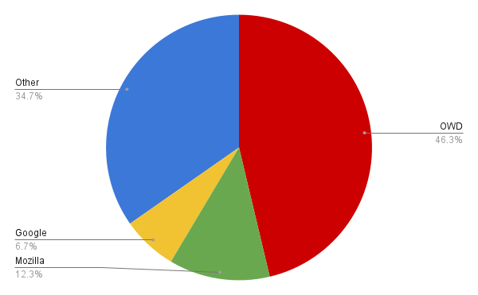
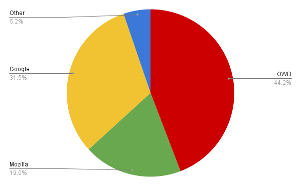

This report provides an update on Open Web Docs for the first quarter of 2022. It’s split into the following parts:

* Goals: a restatement of the overall goals of the organization
* Staff: an update on staffing changes
* Impact: a summary of day to day contributions to documentation projects.
* Projects: a summary of completed projects

## Goals

Just like in 2021, the main focus of Open Web Docs in 2022 has been contributing to MDN Web Docs.

This takes the form of contributions to the main content repositories under the [https://github.com/mdn](https://github.com/mdn) GitHub organization:

* [https://github.com/mdn/content](https://github.com/mdn/content) : the main content repository for MDN Web Docs
* [https://github.com/mdn/browser-compat-data](https://github.com/mdn/browser-compat-data) : the source of browser compatibility data
* [https://github.com/mdn/learning-area](https://github.com/mdn/learning-area) : examples supporting the MDN Learning Area
* [https://github.com/mdn/interactive-examples](https://github.com/mdn/interactive-examples) : source for MDN’s interactive examples

## Staff

At the start of 2022 we were delighted to welcome a new part-time team member, [Queen Vinyl Da.i'gyu-Kazotetsu](https://github.com/queengooborg). Vinyl has been a major contributor to the [BCD](https://github.com/mdn/browser-compat-data) project for several years, initially as a volunteer but most recently as a Google contractor. She is the number #1 contributor to the BCD repository. We’re pleased to have someone to help maintain this essential part of the web docs puzzle.

## Impact

On a daily basis, the Open Web Docs staff team contributes to the open-source repositories of the MDN Web Docs GitHub organization. The contributions can come in many forms (creating pull requests, filing issues, reviewing pull requests, participating in discussions, triaging issues) on a handful of repositories that are foundational to MDN Web Docs.

In this section, we’ll present metrics for the two busiest repositories on the MDN organization:

* [https://github.com/mdn/content](https://github.com/mdn/content), which contains the source for MDN’s pages
* [https://github.com/mdn/browser-compat-data](https://github.com/mdn/browser-compat-data), which contains compatibility data used to power compatibility tables on MDN and other tools including caniuse.com

For each repository we’ll present two metrics:

* **The number of PRs merged to that repository in the quarter.**
* **The number of reviews performed on each merged PR to that repository in the quarter.**

For both these metrics, we’ll not just include numbers for OWD, but also for the other organizations that help maintain the repository, and for volunteer contributors.

### mdn/content

This is the main repository under the MDN organization on GitHub and is extremely active, receiving 500-700 pull requests every month, from about 200 distinct contributors.

Here we’ve split contributions into the following groups:

* OWD staff
* W3C staff (this is actually just Mike Smith)
* Mozilla staff
* Other (mostly volunteers, but also people paid by other organizations to work on MDN)

#### PRs merged to mdn/content

| OWD       | W3C       | Mozilla   | Other |
|-----------|-----------|-----------|-------|
| 295       | 115       | 101       | 1198  |

This shows that OWD is the biggest single organization contributing to mdn/content, as measured by PR volume. It also shows that mdn/content gets a huge volume of contributions from volunteers: 70% of PRs in Q1 were “Other”, which is mostly volunteers.

#### Reviews of PRs merged to mdn/content

| OWD       | W3C       | Mozilla   | Other |
|-----------|-----------|-----------|-------|
| 1096      | 510       | 201       | 163   |

### mdn/browser-compat-data

This is the second-busiest repository in the MDN organization on GitHub. It contains machine-readable JSON files that describe browser support for web platform features. This data is used not only in MDN but also by other sites like [caniuse.com](https://caniuse.com/).

For this repository we’ve split contributions into four groups:

* OWD staff
* Google staff
* Mozilla staff
* Other (mostly volunteers, but also people paid by other organizations to work on MDN)

Note that for browser-compat-data we have not included W3C, as they are not a major contributor to this repository. Instead we have included Google who are a significant contributor.

#### PRs merged to mdn/browser-compat-data

| OWD      | Google    | Mozilla  | Other |
|----------|-----------|----------|-------|
| 268      | 39        | 71       | 201   |

#### Reviews of PRs merged to mdn/browser-compat-data

| OWD      | Google    | Mozilla | Other |
|----------|-----------|---------|-------|
| 304      | 217       | 131     | 36    |

## Projects

In the first quarter of 2022 we continued to work on the projects that were ranked most highly in our Q4 2021 planning. We completed the projects listed below.

### Modernize the JavaScript Learning Area

[See the project proposal](https://github.com/mdn/content/blob/794d08434a0f993205d79d6a3785ab2932098256/rfcs/modernize-learn-js.md).

The Learning Area is the main resource MDN offers for people to learn web development. The JavaScript section of this guide consists of a number of modules, covering:

* fundamentals such as variables, loops, strings, arrays, and functions
* objects and object-oriented programming in JavaScript
* asynchronous programming
* an introduction to some of the main Web APIs.

The JavaScript Learning Area is a popular part of MDN and many people new to Web development take the course. However, when it was written in 2017, many features and techniques that are now mainstream modern JavaScript still seemed too new to recommend without reservation, and many features were not covered at all. Since then it has never been systematically updated to recommend modern JS features and techniques.

In this project, we assessed the complete JavaScript Learning Area and updated it for 2022. This included consistently teaching modern features and practices, and updating all example code to use them. In the process, we completely rewrote the “Objects” and “Async” modules and made many smaller changes throughout.

Thanks to everyone who engaged with this project to discuss how we should rework the content and reviewed PRs, especially [Ruth John](https://github.com/rumyra), [Mike Smith](https://github.com/sideshowbarker), [Hamish Willee](https://github.com/hamishwillee), and [Florian Scholz](https://github.com/Elchi3). Special thanks to [Michael Koch](https://github.com/mikoMK) who's done a fantastic job of helping people through the Learning Area courses and maintaining its content.

### Rewriting reference pages for all web platform events

[See the project proposal](https://github.com/openwebdocs/project/issues/61).

Web developers work with web platform events on a daily basis. A lot of the interactivity of a website is achieved by listening and reacting to events. There are many specifications that define the web platform API surface and most of them define events. It is not easy to figure out available events on a specific object as the specifications do not always list them clearly or there are multiple specifications each defining an object and its event only partially. On MDN Web Docs, we try to list every event that can be fired at a specific object making it an essential reference for web developers who work with events.

There are three ways to set an event listener on an object:

* using a property of the form _onXYZ_,
* using the `addEventListener()` method, or
* using an HTML content attribute in case the object is an HTML element, like `<body onload=””>`.

Over the years, different MDN contributors created different pages for all three ways to listen to the same event. This turned out to be problematic and repetitive. Information was duplicated and updates happened on one page but not on another. This also led to duplicate browser compatibility information that was inconsistent and contradictory.

Two additional things made the MDN event reference worse and lead to further page duplication and inconsistencies:

* [Event bubbling](https://developer.mozilla.org/en-US/docs/Learn/JavaScript/Building_blocks/Events#event_bubbling_and_capture), which makes events available on a whole hierarchy of objects
* [Mixins](https://developer.mozilla.org/en-US/docs/Glossary/Mixin) that define the same event handlers on numerous objects.

The goal of this [Open Web Docs project](https://github.com/openwebdocs/project/issues/61) was to avoid event page duplication, as well as to harmonize and simplify the description of events in the context of their target objects.

The [first part of this project](https://github.com/mdn/browser-compat-data/issues/14578) was to update the compatibility data in BCD with the idea that only one entry, named `eventname_event` is added to the BCD data going forward. There is no longer a separate entry for the `onEventName` property. In case of bubbling events, the entry is placed on the top-most interface of the hierarchy. And for mixins (which we had already mostly removed from MDN and BCD in 2021), the event support is documented on the most relevant interface (e.g. `Window` for `WindowEventHandlers`).

The second part, which happened parallel to the first part, was to update the MDN pages to match the idea of a single place for an event just like in the browser compatibility data. We moved a lot of pages around and adapted the content. All existing `onEventName` are now redirected to the `eventName_event` page that has a syntax section that describes both ways of setting an event listener. The new page structure for event pages was agreed on in an [mdn/content discussion](https://github.com/mdn/content/discussions/10544). We also adapted the interface pages. Now, they list all events that can be caught on an object implementing it, including events that can bubble.

We eliminated roughly 300-400 pages of contradictory information by documenting events in this new, consistent way.

Going forward, this creates a good foundation and a more structured approach to documenting more events on MDN in the future. MDN contributors now understand better how to document events and for readers, the relevant information is more concise and presented in a much clearer way. In the future, we would like to define this _MDN documentation page type_ for web platform events even more so that tooling around mdn/content and mdn/browser-compat-data can work with it smoothly.

This project was driven by Florian Scholz, Jean-Yves Perrier, and Vinyl Da.i'gyu-Kazotetsu. We like to note that it would have been impossible to do this project without the help of [Philip Jägenstedt](https://twitter.com/foolip), who originally proposed many of these changes. Philip not only provided us with his deep web platform knowledge, his input was also essential to solve many weird edge cases and to understand some legacy behaviors that made the rest of us want to give up. Thank you, Philip!

### WAI-ARIA Web Accessibility Documentation

In 2018, a group of folks met for a “Hack-on-MDN in London, UK to work on accessibility documentation. Estelle organized another Accessibility Hack on MDN at the Access U, an accessibility conference in Austin Texas. During these two sessions, excellent accessibility documentation was written, especially with regard to [Web Content Accessibility Guidelines](https://developer.mozilla.org/en-US/docs/Web/Accessibility/Understanding_WCAG). However, the WAI-ARIA ( Accessible Rich Internet Applications ) specification’s roles, states, and properties were not fully addressed and were never updated. This has been resolved.

While HTML is designed to be accessible, developers often use non-semantic elements to recreate form controls and create complex UI features not addressed by existing HTML elements. To make the web content fully accessible, ARIA roles, states and properties can be added to provide semantic information about widgets, structures, and behaviors, enabling screen readers and other assistive technologies to convey appropriate information to users of these technologies.

Over the last two and a half quarters, the WAI-ARIA specification has been documented on MDN. The specification provides an ontology of roles, states, and properties that define accessible user interface elements and can be used to improve the accessibility and interoperability of web content and applications enabling developers to properly convey user interface behaviors and structural information to assistive technologies.

While the new documentation of the ARIA roles and attributes covers everything in the specification, it also provides detailed descriptions on when each role or attribute should be used and, importantly, not used. After all, the first rule of ARIA is "If you can use a native HTML element or attribute with the semantics and behavior you require already built-in, instead of repurposing an element and adding an ARIA role, state or property to make it accessible, then do so."

Each MDN role page provides a description, explanation of required and optional states and properties, keyboard interactions that need to be programmed, and examples. The MDN role documentation provides information beyond what is contained in the WAI-ARI spec, including how to avoid needing to use ARIA (what HTML elements provide optimal semantics),  considerations of visual requirements as widgets need to be usable for everyone, not just screen readers. Considerations for mouse users, keyboard users, and sighted users who also use screen readers for any number of reasons were included when needed.

The project started in Q3 2021 when we documented basic ARIA roles, including landmark roles, window roles, abstract roles, and document structure roles. In Q4 2021, we documented 53 ARIA states and properties. In Q1 or 2022, we revisited ARIA roles, tackling the more complex widget and composite widget roles, creating 29 PRs for 42 tasks. See [Project: Complete the ARIA Roles section](https://github.com/openwebdocs/project/issues/82) for more details.

A huge thank you to [Eric Bailey](https://twitter.com/ericwbailey) and [Scott O’Hara](https://twitter.com/scottohara) for reviewing all the PRs and using their expertise to provide invaluable feedback.
